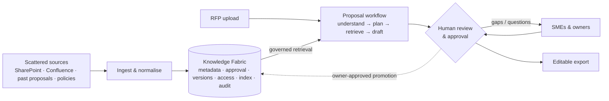

# Tapestry: Product Analysis & Review

> **Status: DRAFT for internal review (manager + architect).** Nothing here is a decision. It is a review of the existing material, with suggestions and options. Recommendations are marked *(rec.)* and are only proposals until they are agreed.
>
> **Date:** 6 October 2026 · **Companion files:** [PRODUCT.md](../PRODUCT.md) (plain-language overview) · [Decision board (interactive)](https://claude.ai/artifact/B2KsV461LrfZErPz7vqaMh)

---

## Contents
1. [Sources reviewed](#1-sources-reviewed)
2. [The project as understood](#2-the-project-as-understood)
3. [What is already strong](#3-what-is-already-strong)
4. [Gaps, contradictions and risks](#4-gaps-contradictions-and-risks)
5. [Suggested refined goal](#5-suggested-refined-goal)
6. [Suggested requirement themes (draft)](#6-suggested-requirement-themes-draft)
7. [Suggested scope and phasing](#7-suggested-scope-and-phasing)
8. [Decisions needed](#8-decisions-needed)
9. [Open questions for Tapestry](#9-open-questions-for-tapestry)
10. [Next steps](#10-next-steps)

---

## 1. Sources reviewed

| Document | Date | What it contributes |
|---|---|---|
| **Proposal & Knowledge Management Platform Evaluation** (`TAPESTRY SOLUTIONS (1).pdf`) | July 2026 | Pain points, Knowledge Fabric + Proposal Assistant concept, reference architecture, illustrative tech stack, build/buy/hybrid comparison, POC prioritisation, discovery questions, stakeholders, objections |
| **RFP-to-Proposal Project Brief** (`Tapestry_RFP_to_Proposal_Project_Brief.pdf`) | 29 Sept 2026 | Clarified scope (proposal generation is the outcome; the fabric is the enabler), 7-step workflow, minimum Knowledge Fabric scope, boundaries, POC definition, acceptance measures, decisions for Tapestry, learning path, agentic design (RAG / agent / MCP), tool contracts, missing requirements, agent-vs-pipeline validation |
| `Tapestry solutions.pdf` | Sept 2026 | Scanned copy of the July evaluation. No new content. |

**How they relate.** The September brief builds on the July evaluation and narrows it. July frames the work as *"a reusable knowledge platform; proposals are the first consumer"* and says to start with retrieval. September makes *proposal generation the user-facing outcome* and adds agentic controls. The two documents agree on direction but **disagree on POC scope** (see §4).

---

## 2. The project as understood

**Problem.** Tapestry answers large, technical government and defense RFPs (DoD, Boeing and other defense contractors) under tight deadlines. The knowledge it needs exists but is spread across SharePoint, Confluence, GitHub, past proposals, documents and SME memory. It is unversioned, has no clear owner or approval status, and is effectively unsearchable at deadline speed. The result is rework, inconsistent claims, SME bottlenecks and deadline risk.

**Solution concept: two connected capabilities**

**Users:** proposal manager / capture lead, SMEs, reviewers (technical, legal, security, commercial), content owners, executive sponsor, and an admin who is not named in the sources.

**Workflow (Sept brief):** Upload → Understand → Plan → Retrieve → Draft → Review → Export.

---

## 3. What is already strong

These should be kept as they are:

- **Clear trust boundaries.** No invented capabilities, certifications, pricing or commitments; unknown facts become questions; nothing is submitted automatically.
- **Governance before retrieval.** Permission, classification, approval and version filters are applied *before* any excerpt reaches the model.
- **Provenance everywhere.** Source, version, owner and approval status sit on every excerpt and claim, with an audit trail of which source version informed each draft.
- **A measured approach to agents.** One orchestrating agent in a durable workflow, compared against a fixed RAG baseline. Specialised agents only once evaluation shows they add value.
- **Security-aware agent design.** RFPs and retrieved files are treated as untrusted; access is enforced outside prompts; tool arguments are validated; runs are bounded by budgets; writes are idempotent.
- **Acceptance measures** (coverage, evidence, governance, freshness, usability, value) that a reviewer can actually check.
- **ITAR/CUI raised early** (July §6.1) as the question that decides everything else.

---

## 4. Gaps, contradictions and risks

### 4.1 Contradictions between the two documents

| # | Finding | Why it matters | Suggestion |
|---|---|---|---|
| C1 | **The POC anchor conflicts.** July: *"Lead the POC with retrieval and grounded Q&A — not proposal generation"* (~4 weeks, 100–200 docs). Sept: the POC should prove the *complete* workflow, then add a bounded agent, an MCP adapter and a measured comparison. | The Sept POC is too much for ~4 weeks. If nobody decides, the team builds everything thinly and proves nothing convincingly. | Decide explicitly (**D1**). *(rec.)* A thin end-to-end slice: one RFP, two sources, full flow at minimal depth. Agent loop and MCP come after the fixed-pipeline baseline. |
| C2 | **Build vs buy is unresolved.** July recommends **Option C (hybrid)**. Sept implicitly assumes a fully custom Angular + Spring Boot build. | The choice changes cost, timeline and the client conversation. Tapestry may ask "why not Loopio or Responsive?" | Record the decision (**D2**). *(rec.)* Keep the Knowledge Fabric custom and inside Tapestry's control, and treat the proposal workspace as replaceable. |
| C3 | **"Confidence score" (July §3.1, §6.5)** versus the Sept statement that *"a model-based verifier … cannot certify factual accuracy"*. | LLM self-reported confidence is poorly calibrated. Showing it to reviewers creates false trust, which is the exact risk in a government proposal. | Drop the numeric confidence score. Show **evidence indicators** instead: cited / uncited claim, source approval status, source age / expiry, conflicting sources found, and gap flags. |
| C4 | **Write-back loop.** July says approved SME edits are *"written back into the Knowledge Fabric"*. Sept says *"keep generated drafts separate from approved knowledge; reuse only after owner approval"*. | Writing back automatically would let AI-generated text become "approved knowledge" without the owner checking it. | Define an explicit **content promotion flow**: proposal text → *nominated* → *owner-reviewed* → *approved library content*, with lineage back to the proposal. Sept's position is the right default. |

### 4.2 Gaps in requirements and scope

| # | Finding | Why it matters | Suggestion |
|---|---|---|---|
| G1 | **ITAR/CUI posture is unknown.** | It determines hosting, model provider, embeddings, OCR service and logging. It could invalidate the whole tech stack. | Make it the first discovery item (**D3**). *(rec.)* Design so the system can move into a CUI boundary, and run the POC on public or synthetic RFPs so it isn't blocked. |
| G2 | **Only raw documents are modelled.** The fabric indexes chunks of source documents. | Proposal teams reuse curated assets: approved answer blocks, boilerplate, past-performance write-ups, resumes, certifications, corporate facts. Retrieval over raw chunks alone gives noisier, less consistent answers (pain point #3). | Add a **curated reusable content library** alongside raw documents, with its own owner and approval lifecycle (**D9**). |
| G3 | **The structure of federal RFPs isn't modelled.** | US federal RFPs commonly follow the Uniform Contract Format: Section C (SOW/PWS), Section L (instructions to offerors), Section M (evaluation factors), plus amendments, CDRLs, page and format limits. The compliance matrix depends on mapping these. | Make the **compliance matrix a first-class output**: requirement → L/M reference → outline section → status (answered / gap / ambiguous / conflict). Capture page and format limits. Handle amendments as diffs. |
| G4 | **The review workflow is generic.** "Allow edits … track review state." | Govcon teams usually run staged colour-team reviews (Pink → Red → Gold), each with different reviewers and exit criteria. | Model **configurable review stages** with role-based sign-off. For the POC, one stage is enough, but the data model should allow several. |
| G5 | **Permission-aware retrieval is underestimated.** | Mirroring per-document ACLs from SharePoint and Confluence (groups, inheritance, sharing links) is a project in itself, and errors here are security incidents. | For the POC, use **classification + group-based access** that the fabric controls itself. Add full source-ACL sync later, as its own work item (**D8**). |
| G6 | **Personas and roles aren't defined** (who can approve, withdraw, export, administer). | Governance can't be designed or tested without a role matrix. | Add a **role/permission matrix** (draft in §6.1). |
| G7 | **Success metrics have no baseline or numeric targets.** | "Faster" can't be shown without a "before". The Sept brief asks for targets "before building" but doesn't say how to get them. | Run a **baseline study in Phase 0** on 2–3 recent RFPs: time to extract requirements, time to first reviewable draft, SME hours, rework (**D10**). |
| G8 | **No early evaluation dataset.** | Retrieval and drafting quality can't be measured, and models or prompts can't be changed safely, without a golden set. | Build a **golden set** in Phase 0: 1–3 RFPs, expected requirement lists, question → correct-source pairs, and planted traps (outdated doc, unapproved doc, denied doc, injected instruction, missing fact). |
| G9 | **Non-functional requirements are missing.** | Performance, scale, availability, retention, accessibility and cost drive architecture choices. | Add an **NFR section** (draft in §6.8), with targets to be confirmed. |
| G10 | **No operating model after the POC.** | Someone must keep the library current: approve, expire and fix conflicts. Without a librarian or owner role, the fabric goes stale and trust collapses. | Define a **content operations model**: owners per domain, review cadence, expiry dates, a conflict queue. |
| G11 | **Adoption and change management aren't covered.** | The July doc notes that "no workflow change" makes the POC easier to accept, but a pilot *does* change workflows. | Plan pilot onboarding: champions, training, feedback loop, and a usage metric (already in July §6.4). |
| G12 | **The learning path sits inside the scope document.** | It mixes personal upskilling with the client-facing scope and confuses readers. | Keep the learning plan in a separate personal document. Keep project scope neutral. |
| G13 | **Tool and agent contracts come before the domain model.** | Tool contracts (§15 of the Sept brief) depend on core entities: RFP, Requirement, Section, Evidence, Source, SourceVersion, Gap, Review. | Define the **domain model** first in Phase 0 (architecture docs), then derive the tool contracts from it. |
| G14 | **Output format and template are undecided.** | Export fidelity (headings, tables, styles, page limits) is often underestimated. | Get Tapestry's actual proposal template early and decide the v1 output (**D5**). |

### 4.3 Key risks

| Risk | Likelihood | Impact | Mitigation |
|---|---|---|---|
| Source access or security approval is slow and blocks the POC | High | High | Use public or synthetic RFPs and exported documents. Request access in week 1. Prefer controlled import over live connectors for the POC (**D7**). |
| CUI is confirmed late and forces re-platforming | Medium | High | Choose services that can run inside a compliant boundary. Keep the model and embedding provider behind an interface (**D3**, **D11**). |
| Retrieval quality on long technical documents is poor | Medium | High | Hybrid keyword + semantic search, structure-aware chunking, measurement on the golden set, a fixed-pipeline baseline first |
| Reviewers over-trust AI drafts | Medium | High | Evidence indicators instead of confidence scores, mandatory review state, gaps flagged clearly |
| Scope creep from "platform" ambitions (July "wins the room") | High | Medium | Strict phase gates. Other consumers of the fabric only after v1. |
| Prompt injection through RFP or source content | Medium | High | Untrusted-input handling, access enforced in services, tool allow-lists, injection cases in the golden set |
| Costs grow with 100+ page RFPs | Medium | Medium | Per-run budgets, caching, usage tracking from day one |

---

## 5. Suggested refined goal

The current goal statement mixes **what** (two capabilities) with **how** (RAG, agents, MCP). The suggestion is to state the outcome and keep the solution approach separate.

**Problem statement (suggested)**
> Tapestry's proposal teams spend too much time finding, checking and rewriting knowledge that already exists. In high-stakes government and defense bids, this puts deadlines, consistency and compliance at risk.

**Vision (suggested)**
> Every Tapestry proposal starts from the company's best approved knowledge. That knowledge can be found in minutes, traced to its source and reviewed by the right people.

**Goals (suggested)**
| ID | Goal | Measured by |
|---|---|---|
| G-1 | Cut the time from RFP receipt to a first reviewable draft | Hours vs baseline |
| G-2 | Make sure every mandatory requirement is answered or visibly flagged | Coverage % on sampled RFPs |
| G-3 | Make every material claim traceable to an approved, current source | Unsupported-claim count; citation resolution |
| G-4 | Reduce repeat SME effort | SME hours per proposal; repeat questions routed |
| G-5 | Build a governed knowledge foundation that other teams can reuse later | Fabric has no proposal-specific coupling (architecture review) |

**Non-goals (suggested)**
- A general-purpose chat assistant
- Automatic submission or publication
- Generating pricing, staffing, commitments or compliance assertions
- Replacing SMEs or proposal managers
- Bid/no-bid or capture management
- Migrating all legacy content during the POC
- Model fine-tuning, until a baseline and evaluation set exist

---

## 6. Suggested requirement themes (draft)

> These are **candidate** requirements to feed the formal SDD specs later. They are not the specs. Priority is a suggestion for the **POC** (Must / Should / Could / Later).

### 6.1 Roles (draft)
| Role | Main tasks | Key permissions |
|---|---|---|
| Proposal manager | Upload RFP, correct extraction, approve outline, assign gaps, export | Create/edit proposals they own; export |
| SME | Answer gaps, edit assigned sections | Edit assigned sections; read permitted sources |
| Reviewer (tech / legal / security / commercial) | Review and approve sections at a stage | Comment, approve or reject at the assigned stage |
| Content owner | Approve, update, expire or withdraw library content; resolve conflicts | Manage content in their domain |
| Admin | Sources, roles, classifications, budgets | Configuration; no implicit content access |
| Executive viewer | See progress and metrics | Read-only dashboards |

### 6.2 Knowledge Fabric (KF)
| ID | Candidate requirement | POC |
|---|---|---|
| KF-01 | Register each source with owner, access method, classification and sync method (source inventory) | Must |
| KF-02 | Ingest from ≥2 agreed sources (connector or controlled import). Extract text and tables, preserve page/section locations and original links | Must |
| KF-03 | Store metadata per document and chunk: ID, owner, version, classification, access groups, approval status, effective/expiry date, source location | Must |
| KF-04 | Detect changed, deleted and superseded content. Re-index and exclude superseded versions | Must |
| KF-05 | Detect duplicates and near-duplicates, and flag conflicting statements to owners | Should |
| KF-06 | Let owners approve, update, set expiry and withdraw content | Must (minimal) |
| KF-07 | A curated reusable content library (answer blocks, past performance, resumes, certifications) with its own lifecycle | Should |
| KF-08 | Hybrid keyword + semantic retrieval, with permission, classification, approval and version filters applied server-side before results reach the model | Must |
| KF-09 | Content promotion: proposal text can be nominated and becomes library content only after the owner approves it | Could |

### 6.3 RFP intake & analysis (RFP)
| ID | Candidate requirement | POC |
|---|---|---|
| RFP-01 | Accept the agreed formats (PDF, DOCX, scanned PDF via OCR) and attachments. Reject unreadable files with a reason | Must |
| RFP-02 | Extract requirements, instructions, questions, deliverables, deadlines and constraints with page references into a structured list | Must |
| RFP-03 | Recognise federal structure (Sections C / L / M, SOW/PWS, CDRLs) and page or format limits | Should |
| RFP-04 | Let users correct, merge, split and add extracted items | Must |
| RFP-05 | Generate a compliance matrix: requirement → section → status (answered / gap / ambiguous / conflict) | Must |
| RFP-06 | Handle amendments: compare against the original and identify affected requirements and sections | Could |

### 6.4 Drafting (DR)
| ID | Candidate requirement | POC |
|---|---|---|
| DR-01 | Propose a response outline mapped to requirements and evaluation criteria | Must |
| DR-02 | Draft selected sections only from retrieved approved evidence and explicitly supplied pursuit facts | Must |
| DR-03 | Link every material claim to its evidence (source, version, location) | Must |
| DR-04 | Mark unsupported claims and missing evidence as gaps, and assign each gap to a named person | Must |
| DR-05 | Take pricing, staffing, commitments and certifications only from human input, never from generation | Must |
| DR-06 | Regenerate a selected section with instructions, keeping previous versions | Should |
| DR-07 | Use win themes and discriminators supplied by the capture lead | Could |

### 6.5 Review & approval (RV)
| ID | Candidate requirement | POC |
|---|---|---|
| RV-01 | Inline edit, comment, accept and reject per section | Must |
| RV-02 | Track draft versions and review state per section | Must |
| RV-03 | Assign gaps to SMEs, pause the workflow, and resume when answered | Must |
| RV-04 | Configurable review stages (e.g. Pink / Red / Gold) with role-based sign-off | Could |
| RV-05 | An evidence panel showing the source excerpt and metadata next to each claim | Must |

### 6.6 Export (EX)
| ID | Candidate requirement | POC |
|---|---|---|
| EX-01 | Export an editable DOCX in the agreed template, preserving headings and tables | Must |
| EX-02 | Export the compliance matrix (XLSX or DOCX) | Must |
| EX-03 | An internal traceability report (claim → source version) | Should |
| EX-04 | Check page limits and formatting before export | Could |

### 6.7 Governance, audit & AI controls (GV / AI)
| ID | Candidate requirement | POC |
|---|---|---|
| GV-01 | SSO with the organisation's identity provider, and role-based access as in §6.1 | Must |
| GV-02 | Enforce access and classification server-side on every search and read, including cached results | Must |
| GV-03 | An audit log of user actions, tool calls and the source versions behind each draft | Must |
| GV-04 | Keep generated drafts separate from approved knowledge | Must |
| GV-05 | When a source changes or is withdrawn, flag affected drafts for revalidation | Should |
| GV-06 | Hosting, model and provider rules per data classification (per **D3**) | Must |
| GV-07 | A retention and deletion policy for RFPs, drafts and logs | Should |
| AI-01 | Persisted workflow states (analysing, researching, drafting, awaiting review, completed, failed) with safe retry, cancel and resume, and idempotent writes | Must |
| AI-02 | Configurable budgets for tool calls, revisions, time and tokens/cost. Stop or hand off when a limit is reached | Must |
| AI-03 | Treat RFP and retrieved content as untrusted. Validate tool arguments, and include injection cases in tests | Must |
| AI-04 | Validate structured outputs against schemas, with explicit error states | Must |
| AI-05 | Observability: run and section IDs, tool calls, evidence versions, latency and usage, with sensitive fields redacted | Must |
| AI-06 | An evaluation harness on the golden set (retrieval precision/recall, citation support, coverage) that runs on every change | Must |
| AI-07 | A bounded agent loop (search → inspect → revise) measured against the fixed pipeline | Should (per **D6**) |
| AI-08 | An MCP server exposing the approved tools | Later |

### 6.8 Non-functional (NF), with targets to be confirmed
| ID | Area | Candidate requirement |
|---|---|---|
| NF-01 | Performance | Extraction of a 120-page RFP finishes within *X* minutes; search p95 below *Y* seconds |
| NF-02 | Scale | POC: 100–200 documents. Pilot: thousands. Design target to be confirmed |
| NF-03 | Availability | POC: business hours. Pilot and v1 targets to be confirmed |
| NF-04 | Security | Encryption in transit and at rest, managed secrets, least privilege, no sensitive data in logs |
| NF-05 | Cost | A per-proposal cost ceiling, with usage dashboards |
| NF-06 | Accessibility | Review UI meets WCAG 2.1 AA |
| NF-07 | Audit retention | Retention period to be confirmed with Tapestry legal |

---

## 7. Suggested scope and phasing

Durations are **indicative only** and depend on access approvals and **D1**.

| Phase | Purpose | In scope | Out of scope |
|---|---|---|---|
| **0 · Define** *(now)* | Agree what and why | Goal, requirements, user and application flows, governance, architecture, UI preview, tech-stack decision, baseline study, golden set, sample data | Any production build |
| **1 · POC** *(~4–6 wks)* | Prove the workflow on safe data | Per **D1** *(rec. thin slice)*: 1 RFP, 2 sources (~100–200 docs), import-based ingestion, metadata and approval, change handling, governed retrieval, extraction, compliance matrix, 2–3 grounded sections, one review stage, DOCX export, traps that prove exclusions | Live connectors (unless approved early), full ACL sync, agent loop, MCP, multi-stage reviews |
| **2 · Pilot** | Prove it on a live proposal | Live connectors, curated library, amendments, configurable review stages, bounded agent loop *if* the evaluation shows it adds value | Organisation-wide rollout |
| **3 · v1** | Wider use | More sources, full ACL sync, content operations model, admin, dashboards, MCP adapter if needed | Other consumers of the fabric |
| **Later** | Extend the platform | Engineering assistant, onboarding, compliance search, specialised agents, fine-tuning if justified | n/a |

---

## 8. Decisions needed

All decisions are **open**. The interactive decision board gives each one with options, trade-offs and a place to record preferences and notes.

| ID | Decision | Options | Suggested *(rec.)* | Depends on |
|---|---|---|---|---|
| **D1** | POC direction | A. Thin end-to-end slice · B. Retrieval & Q&A first (July) · C. Full Sept brief as written | A | D3, D7 |
| **D2** | Solution path | A. Custom-built · B. Commercial RFP platform · C. Hybrid: custom fabric, replaceable workspace | C | D3 |
| **D3** | Security posture until ITAR/CUI is confirmed | A. CUI-ready, POC on safe data · B. Commercial cloud is fine · C. Strict on-prem / self-hosted | A | n/a |
| **D4** | Primary audience for Phase 0 deliverables | A. Client engagement · B. Internal team / AI CoE · C. Personal upskilling build | B now, A once aligned | n/a |
| **D5** | What v1 produces | A. Compliance matrix only · B. Matrix + section drafts · C. Full proposal draft · D. All three | B | D1 |
| **D6** | Orchestration approach | A. Fixed pipeline first, bounded agent after evaluation · B. Agent-first · C. Fixed pipeline only | A | D1 |
| **D7** | First sources & ingestion method | A. Controlled import (past proposals + policy docs) · B. Live connectors (SharePoint + Confluence) · C. Mixed: one import + one connector | A for POC | D3 |
| **D8** | POC access-control model | A. Classification + group access · B. Full source-ACL sync · C. Single trusted POC group | A | D3, D7 |
| **D9** | Content model | A. Raw documents only · B. Raw documents + curated reusable library · C. Curated library only | B | n/a |
| **D10** | Success metrics & targets | A. Baseline study first, then numeric targets · B. Agree targets at kickoff without a baseline · C. Qualitative reviewer rubric only | A | n/a |
| **D11** | Tech-stack baseline | A. Team stack: Angular + Spring Boot (Spring AI) + GCP (Vertex AI models, Cloud SQL Postgres + pgvector + full-text, Document AI, Cloud Storage) · B. Spring Boot core + Python AI service (LangGraph) · C. Managed GCP AI (Vertex AI Search / Agent Engine) | A | D3, D2 |

> **D11 note.** Compliance authorisations (FedRAMP High, DoD IL4/IL5, ITAR support) differ by service and region and change over time. Check the *current* authorisation of every chosen service, including the model provider and OCR, inside the required boundary before committing. Do not assume any of them.

---

## 9. Open questions for Tapestry

Combined from both source documents, with additions.

**Outcome & scope**
1. What exact output is expected: a compliance matrix, section drafts, a full proposal, or all three? Which template and file formats?
2. Which RFP types and formats matter first (scanned PDFs, tables, appendices, amendments)?
3. What does leadership count as success: time saved, more bids, win rate, or SME load?
4. How many RFPs per quarter, what is the typical turnaround, and how much time goes on searching versus writing?
5. Has a deadline been missed or nearly missed because of content problems in the last year?

**Content & ownership**
6. Which repositories hold the highest-value reusable content, and who owns each?
7. Who decides approval, validity, classification and access rights? Is there an existing sign-off process to build on?
8. Which facts are reusable approved knowledge, and which must be supplied per pursuit (pricing, staffing, commitments)?
9. Who resolves duplicates, contradictions and missing metadata, both now and after go-live?
10. Is there a curated answer library or boilerplate set today?

**Security & access**
11. Is any content ITAR-controlled or CUI? What is the classification scheme?
12. Which hosting and model-provider boundaries are allowed (commercial cloud, FedRAMP High / IL4–5, GovCloud, on-prem)?
13. Who signs off security for the POC, and how long does that usually take?
14. What access is possible per source: connector/API, export, or manual import?
15. Which identity provider is used (Entra ID, Okta, …)?

**Process**
16. Who reviews technical, legal, security and commercial claims? What are the review stages (colour teams) and expected turnaround?
17. Can we have 1–3 representative, permitted past RFPs plus their final submitted proposals for the baseline and golden set?

---

## 10. Next steps

1. **Review this analysis and the decision board** with the manager and architect, and record preferences on the board.
2. **Narrow the open questions** to a discovery agenda for Tapestry (§9).
3. **Start the Phase 0 groundwork that doesn't depend on any decision:** collect public or synthetic RFP samples, draft the golden set, and outline the baseline study.
4. **Receive the SDD instructions**, then produce the formal specs in:
   - [`docs/requirements/`](requirements/): requirements specs
   - [`docs/architecture/`](architecture/): domain model, user and application flows, governance, architecture
   - [`docs/tech-stack/`](tech-stack/): tech-stack analysis and decision records
5. After that: UI preview and design.
